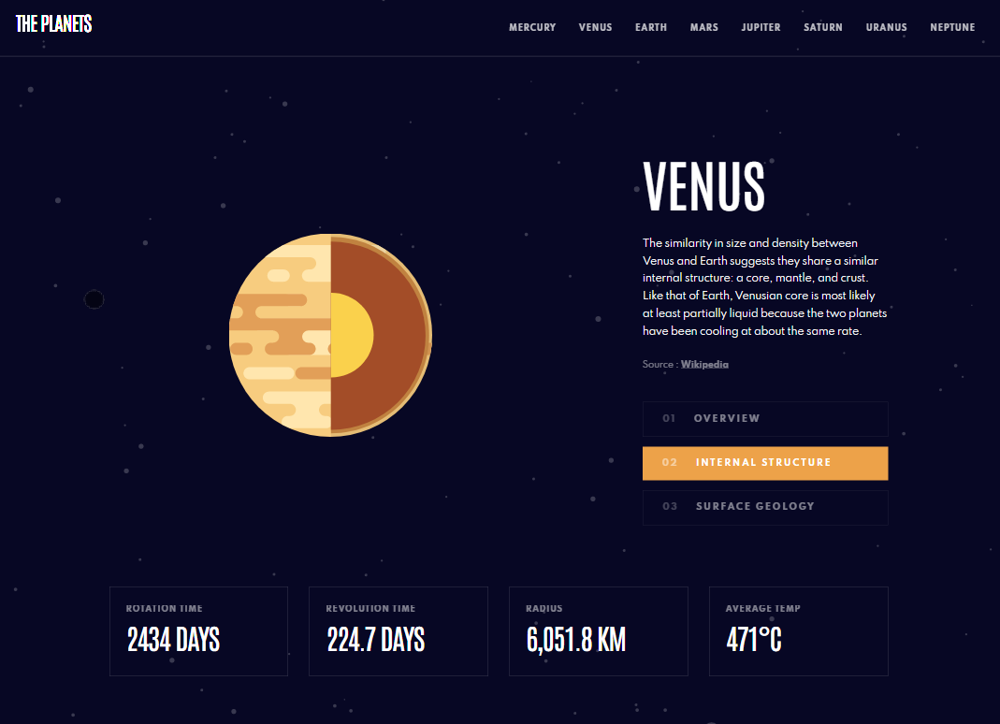
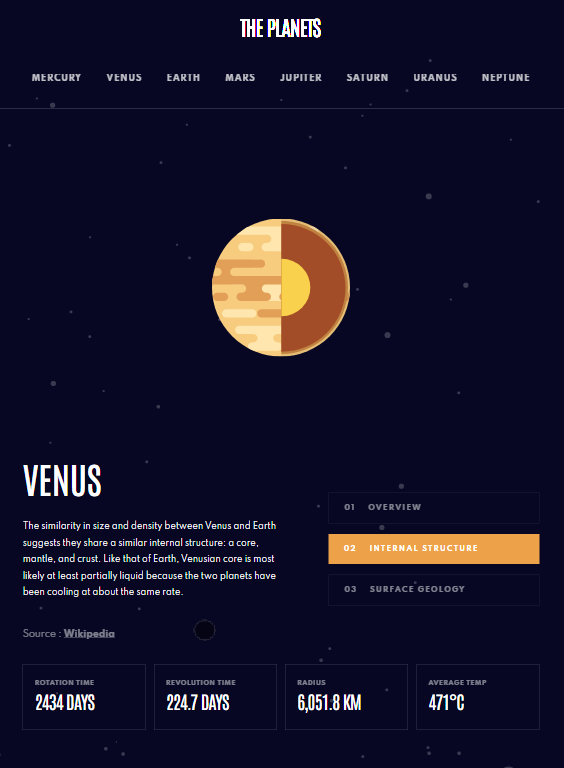
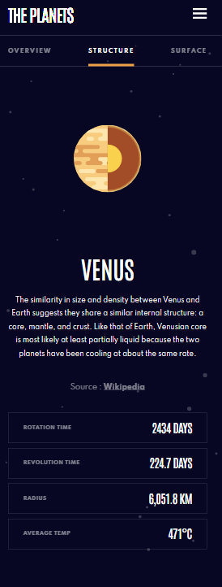
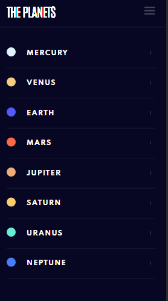

# Planets fact site

## Table of contents

- [Overview](#overview)
  - [The challenge](#the-challenge)
  - [Screenshot](#screenshot)
  - [Links](#links)
- [My process](#my-process)
  - [Built with](#built-with)
  - [What I learned](#what-i-learned)
  - [Continued development](#continued-development)

## Overview

This is another Frontend Mentor project. I received the Figma designs, then built the website. I learned a lot when making this site and also added a lot of my own personal touches. 

This was the first project that I have used Framer Motion. It was quite challenging at first, but I have a much better understanding of it now. 

This was also the first time that I have tested a react app of my own. I used Jest, RTL, and Storybook. I feel quite confident writing the tests, but I still struggle to know what I should test at times.

After completing the project and looking back over my code, I can think of so many ways to improve it. I hope to do this in my next project. 

In my next project, I am aiming to include an external database as opposed to having a data object within the project.

### The challenge

Users should be able to:

- View the optimal layout for the app depending on their device's screen size
- See hover states for all interactive elements on the page
- View each planet page and toggle between "Overview", "Internal Structure", and "Surface Geology"

### Screenshot

### Links

- Solution URL: [Add solution URL here](https://your-solution-url.com)
- Live Site URL: [https://main--luminous-dragon-8ab7ce.netlify.app/](https://main--luminous-dragon-8ab7ce.netlify.app/)

## My process

### Built with

- Semantic HTML5 markup
- CSS
- Flexbox
- Mobile-first workflow
- Framer Motion
- React Router Dom
- Redux Toolkit
- Storybook
- React Testing Library
- Jest
- Husky
- Reactjs

### What I learned

- Framer Motion
- Testing my own React App
- How to use husky.

### Continued development

I'm hoping to use an external database in my next project. I will also update this project with an external database.

## Current Issues

- Need to add an external database.
- Need to refactor and improve my testing.
- When the nav links are spammed, it breaks the animations and user must refresh.
- Need to improve the state management.